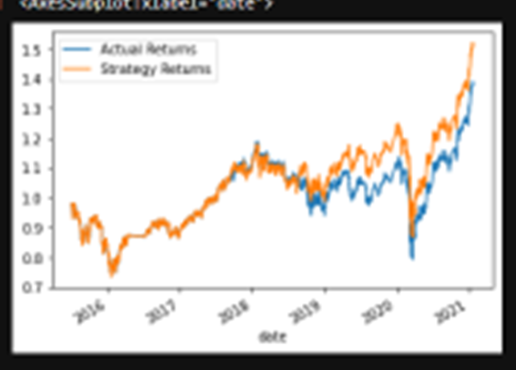
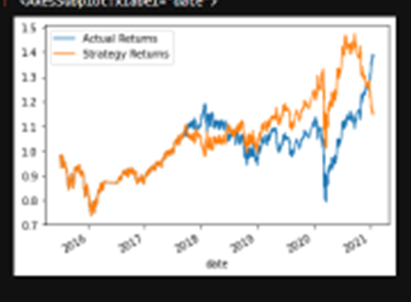
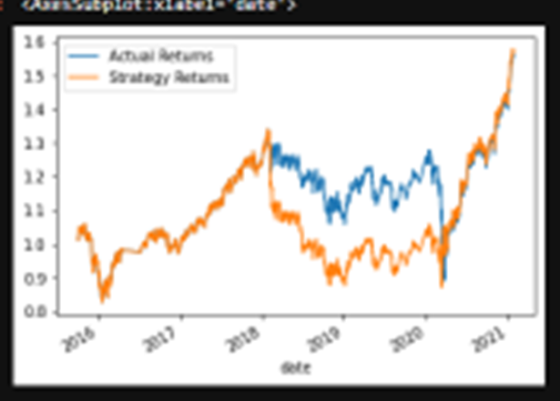

# 14_machine_learning_trading_bot

This repo contains the results of the module 14 challenge. To view the file, open the "machine_learning_trading_bot" folder and then the "machine_learning_trading_bot.ipynb" file. 

Here, I assumed the role of a financial advisor at one of the top five financial advisory firms in the world. The firm constantly competes with the other major firms to manage and automatically trade assets in a highly dynamic environment. In recent years, the firm has heavily profited by using computer algorithms that can buy and sell faster than human traders.

The speed of these transactions gave the firm a competitive advantage early on. But, people still need to specifically program these systems, which limits their ability to adapt to new data. To improve the existing algorithmic trading systems and maintain the firm’s competitive advantage in the market, I enhanced the existing trading signals with machine learning algorithms that can adapt to new data.

To do so, I combined my algorithmic trading skills with existing skills in financial Python programming and machine learning to create an algorithmic trading bot that learns and adapts to new data and evolving markets. Specifically, l accomplished the following goals:

(1) Implemented an algorithmic trading strategy that uses machine learning to automate trade decisions.
(2) Adjusted the input parameters to optimize the trading algorithm.
(3) Trained a new machine learning model and compared its performance to that of a baseline model.
(4) Created a report that compares the performance of the machine learning models based on the trading predictions that each makes and the resulting cumulative strategy returns.

To accomplish these goals, I completed the following steps:

(1) Established a Baseline Performance
(2) Tuned the Baseline Trading Algorithm
(3) Evaluated a New Machine Learning Classifier
(4) Created an Evaluation Report

## Installation Guide

The following package needs to be installed into the development environment.

```python
!pip install hvplot
```
---

## Technologies

This project leverages python 3.7 with the following libraries and dependencies:

* [pandas](https://github.com/pandas-dev/pandas) - For manipulating data

* [hvplot](https://github.com/holoviz/hvplot) - High-level plotting API for the PyData ecosystem built on HoloViews

* [sklearn](https://github.com/scikit-learn/scikit-learn) - Module for machine learning built on top of SciPy

* [matplotlib](https://github.com/matplotlib/matplotlib) - Creating static, animated, and interactive visualizations

---

### **Step 1: Established a Baseline Performance**

In this section, I established a baseline performance for the trading algorithm by completing the following steps:

(1) Imported the OHLCV dataset into a Pandas DataFrame.

(2) Generated trading signals using short- and long-window SMA values.

(3) Split the data into training and testing datasets.

(4) Used the `SVC` classifier model from SKLearn's support vector machine (SVM) learning method to fit the training data and make predictions based on the testing data. Reviewed the predictions.

(5) Reviewed the classification report associated with the `SVC` model predictions.

(6) Created a predictions DataFrame that contains columns for “Predicted” values, “Actual Returns”, and “Strategy Returns”.

(7) Created a cumulative return plot that shows the actual returns vs. the strategy returns, which served as a baseline against which to compare the effects of tuning the trading algorithm. 

(8) Conclusions about the performance of the baseline trading algorithm. 

The baseline trading algorithm performs well. There is a strong relationship between the actual and strategy returns, with the strategy returns outperforming (1.5x to 1.3x).

### **Step 2: Tuned the Baseline Trading Algorithm**

In this section, I tuned, or adjusted, the model’s input features to find the parameters that resulted in the best trading outcomes. (I chose the best by comparing the cumulative products of the strategy returns.)

To do so, I completed the following steps:

(1) Tuned the training algorithm by adjusting the size of the training dataset. To do so, sliced the data into different periods. Reran the notebook with the updated parameters, and recorded the results. To adjust the size of the training dataset, I used a different `DateOffset value` of 6 months instead of 3 months.

    Answered the following question: What impact resulted from increasing or decreasing the training window?
   
Tuning the training algorithm to 6 months, increases the range of returns for the actual and strategy returns from  1.3x to 1.5x and 1.5x to 1.8x, respectively.
    
(2) Tuned the trading algorithm by adjusting the SMA input features. Adjusted one or both of the windows for the algorithm. Rerun the notebook with the updated parameters, and recorded the results in a README.md file. 

    Answered the following question: What impact resulted from increasing or decreasing either or both of the SMA windows?
    
Based on a fast of SMA of 4 and slow SMA of 100, the Strategy Returns were 1.5x vs. 1.3x for the Actual Returns. Based on a fast of SMA of 20 and slow SMA of 200, the Strategy Returns were about 1.8x vs. about 1.4x for the Actual Returns. Also, the weighted average of precision and recall fell from .51 and .56 in the baseline case to .49 and .55 in the tuned case. 

(3) Chose the set of parameters that best improved the trading algorithm returns. 

*  

The baseline parameters were better for ensuring the accuracy of the model. 
    
### **Step 3: Evaluated a New Machine Learning Classifier**

In this section, I used the original parameters and applied them to the performance of a second machine learning model.

To do so, I completed the following steps:

(1) Experimented with importing a new classifier, such as `AdaBoost`, `DecisionTreeClassifier`, or `LogisticRegression`.

(2) Used the original training data as the baseline model, fit another model with the new classifier.

(3) Backtested the new model to evaluate its performance. 
    
    Saved a PNG image of the cumulative product of the actual returns vs. the strategy returns for this updated trading algorithm, and wrote conclusions 
    
*  

    Answered the following questions: 
    
        Did this new model perform better or worse than the provided baseline model? 

This new model performed worse. 
    
        Did this new model perform better or worse than your tuned trading algorithm?
        
This new model performed better than the tuned trading alorithm. 

### **Step 4: Created an Evaluation Report**

Here, I added a summary evaluation report. For this report, I expressed my final conclusions and analysis. I supported my findings by using the PNG images created.  

*  

This new model with 6 month window performed better than the origional tuned trading alorithm. 

---
## Contributors

Brought to you by Wilson Rosa. https://www.linkedin.com/in/wilson-rosa-angeles/.

---
## License

MIT